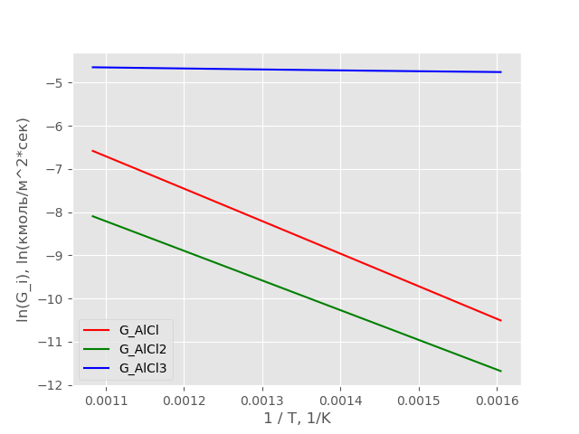
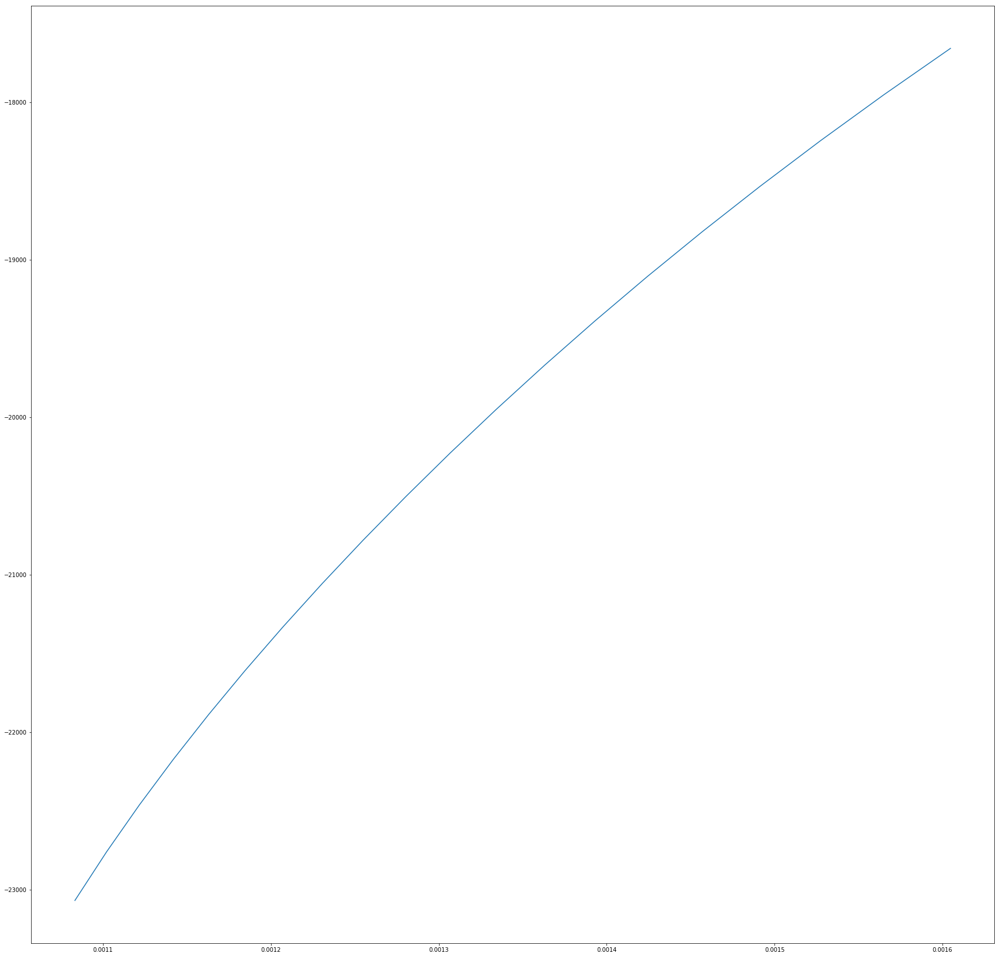
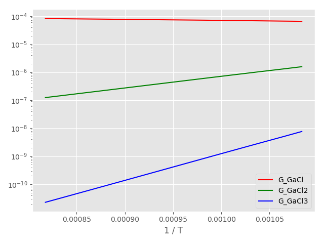
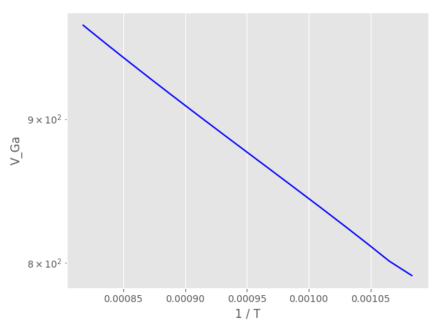

$ 2Al(solid) + 2HCl \Leftrightarrow 2AlCl + H_2\ \ \ \ \ \ \ \ \ \ \ \ \ \ \ \ \ \ \ \ \ \ \ \ \ \ \ \ \ \ \ \ \ \ \ \ \ \ (R1)$
$ Al(solid) + 2HCl \Leftrightarrow AlCl_2 + H_2\ \ \ \ \ \ \ \ \ \ \ \ \ \ \ \ \ \ \ \ \ \ \ \ \ \ \ \ \ \ \ \ \ \ \ \ \ \ \ \ (R2)$
$ 2Al(solid) + 6HCl \Leftrightarrow 2AlCl_3 + 3H_2\ \ \ \ \ \ \ \ \ \ \ \ \ \ \ \ \ \ \ \ \ \ \ \ \ \ \ \ \ \ \ \ \ \ (R3)$

$2Ga(liquid) + 2HCl \Leftrightarrow 2GaCl + H_2\ \ \ \ \ \ \ \ \ \ \ \ \ \ \ \ \ \ \ \ \ \ \ \ \ \ \ \ \ \ \ \ \ \  (R4)$
$Ga(liquid) + 2HCl \Leftrightarrow GaCl_2 + H_2\ \ \ \ \ \ \ \ \ \ \ \ \ \ \ \ \ \ \ \ \ \ \ \ \ \ \ \ \ \ \ \ \ \ \ \ (R5)$
$2Ga(liquid) + 6HCl \Leftrightarrow 2GaCl_3 + 3H_2\ \ \ \ \ \ \ \ \ \ \ \ \ \ \ \ \ \ \ \ \ \ \ \ \ \ \ \ \ \ (R6)$

$AlCl + NH_3 \Leftrightarrow AlN(solid) + HCl + H_2\ \ \ \ \ \ \ \ \ \ \ \ \ \ \ \ \ \ \ \ \ \ \ \ \ \ \ (R7)$
$2AlCl_2 + 2NH_3 \Leftrightarrow 2AlN(solid) + 4HCl + H_2\ \ \ \ \ \ \ \ \ \ \ \ \ \ \ \ \ (R8)$
$AlCl_3 + NH_3 + \Leftrightarrow AlN(solid) + 3HCl\ \ \ \ \ \ \ \ \ \ \ \ \ \ \ \ \ \ \ \ \ \ \ \ \ \ \ \ \ \ (R9)$
$GaCl + NH_3 \Leftrightarrow GaN(solid) + HCl + H_2\ \ \ \ \ \ \ \ \ \ \ \ \ \ \ \ \ \ \ \ \ \ \ \ \ (R10)$
$2GaCl_2 + 2NH_3 \Leftrightarrow 2GaN(solid) + 4HCl + H_2\ \ \ \ \ \ \ \ \ \ \ \ \ \ \ (R11)$
$GaCl_3 + NH_3 \Leftrightarrow GaN(solid) + 3HCl\ \ \ \ \ \ \ \ \ \ \ \ \ \ \ \ \ \ \ \ \ \ \ \ \ \ \ \ \ \ \ (R12)$

## **Часть 1. Моделирование конверсии** **HCl в хлориды алюминия** 

$$
G_i = D_i {(P^g_i - P^e_i)\over R T \delta}
$$
$$
𝐾_1={(𝑃^{\ e}_{𝐻𝐶𝑙})^2\over(𝑃^{\ e}_{Al𝐶𝑙})^2𝑃^{\ e}_{𝐻_2}}
$$
$$
𝐾_2={(𝑃^{\ e}_{𝐻𝐶𝑙})^2\over𝑃^{\ e}_{Al𝐶𝑙_2}𝑃^{\ e}_{𝐻_2}}
$$
$$
𝐾_3={(𝑃^{\ e}_{𝐻𝐶𝑙})^6\over(𝑃^{\ e}_{Al𝐶𝑙_3})^2(𝑃^{\ e}_{𝐻_2})^3}
$$
$$
D_{HCl}(P^g_{HCl}-P^e_{HCl})+2D_{H_2}(P^g_{H_2}-P^e_{H_2})=0
$$
$$
D_{AlCl}(P^g_{AlCl} - P^e_{AlCl}) + 2D_{AlCl_2}(P^g_{AlCl_2} - P^e_{AlCl_2}) + 3D_{AlCl_3}(P^g_{AlCl_3} - P^e_{AlCl_3}) + D_{HCl}(P^g_{HCl} - P^e_{HCl}) = 0
$$
$$
V^e_{Al} = (G_{AlCl} + G_{AlCl_2} + G_{AlCl_3})({\mu_{Al}\over\rho_{Al}})*10^9
$$

## **Часть 2. Моделирование конверсии** **HCl в хлориды галлия** 

$$
𝐾_1={(𝑃^{\ e}_{𝐻𝐶𝑙})^2\over(𝑃^{\ e}_{Ga𝐶𝑙})^2𝑃^{\ e}_{𝐻_2}}
$$
$$
𝐾_2={(𝑃^{\ e}_{𝐻𝐶𝑙})^2\over𝑃^{\ e}_{Ga𝐶𝑙_2}𝑃^{\ e}_{𝐻_2}}
$$
$$
𝐾_3={(𝑃^{\ e}_{𝐻𝐶𝑙})^6\over(𝑃^{\ e}_{Ga𝐶𝑙_3})^2(𝑃^{\ e}_{𝐻_2})^3}
$$
$$
D_{HCl}(P^g_{HCl}-P^e_{HCl})+2D_{H_2}(P^g_{H_2}-P^e_{H_2})=0
$$
$$
D_{GaCl}(P^g_{GaCl} - P^e_{GaCl}) + 2D_{GaCl_2}(P^g_{GaCl_2} - P^e_{GaCl_2}) + 3D_{GaCl_3}(P^g_{GaCl_3} - P^e_{GaCl_3}) + D_{HCl}(P^g_{HCl} - P^e_{HCl}) = 0
$$
$$
V^e_{Ga} = (G_{GaCl} + G_{GaCl_2} + G_{GaCl_3})({\mu_{Ga}\over\rho_{Ga}})*10^9
$$

