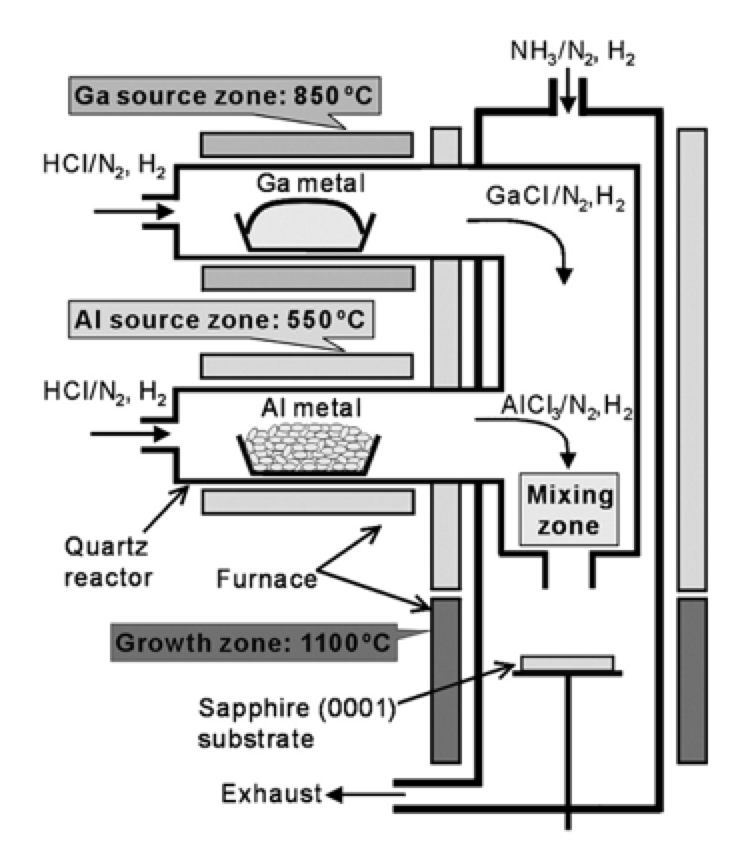

# Моделирование роста монокристаллического твердого раствора $Al_xGa_{1-x}N$ методом хлоридной эпитаксии

### Введение

Нитриды металлов $III$ группы – алюминия, галлия и индия – в настоящее время рассматриваются как исключительно перспективные материалы для производства широкого класса полупроводниковых оптоэлектронных и силовых приборов нового поколения с уникальными рабочими характеристиками. К числу таких приборов относятся твердотельные лазеры, светодиоды, мощные высокочастотные транзисторы, диоды Шоттки и т.д. Важнейшая роль этих материалов была косвенно подчеркнута присуждением Нобелевской премии по физике 2014 г. трем японским ученым «за создание энергосберегающих и экологически безвредных источников света - синих светодиодов (LED)» – приборов, которые удалось разработать только на основе $III$-нитридов.

Среди $III$-нитридов особую роль играет твердый раствор нитрида алюминия ($AlN$) и нитрида галлия ($GaN$) – т.н. алган ($Al_xGa_{1-x}N$ = $(AlN)_x(GaN)_{1-x}$). Этот материал служит основой для создания коротковолновых (до глубоко ультрафиолетового диапазона) оптоэлектронных приборов, которые находят применение в самых разных современных оптических технологиях. Однако, создание приборных структур на основе алгана требует управляемого выращивания очень тонких (до одного монослоя) монокристаллических слоев материала заданной толщины и состава, что является чрезвычайно сложной технологической задачей. Одним из перспективных подходов к решению этой задачи служит т.н. хлоридная эпитаксия.

Типовая схема технологического процесса хлоридной эпитаксии приведена на Рис. 1. В источники, содержащие твердый алюминий ($Al$) и жидкий галлий ($Ga$), нагретые до температур порядка 550 °С и 850 °С, соответственно, подается хлороводород ($HCl$), разбавленный химически инертным несущим газом – азотом ($N2$). При этом в источнике алюминия в результате (обратимых) поверхностных химических реакций

$$
2Al(solid) + 2HCl \Leftrightarrow 2AlCl + H_2
$$
$$
Al(solid) + 2HCl \Leftrightarrow AlCl_2 + H_2
$$
$$
2Al(solid) + 6HCl \Leftrightarrow 2AlCl_3 + 3H_2
$$
образуются газообразные хлориды алюминия – $AlCl$, $АlC_l2$ и $AlCl_3$ – активные летучие соединения, из которых далее растет $AlN$-составляющая алгана. В источнике галлия в результате аналогичных реакций
$$
2Ga(liquid) + 2HCl \Leftrightarrow 2GaCl + H_2
$$
$$
Ga(liquid) + 2HCl \Leftrightarrow GaCl_2 + H_2
$$
$$
2Ga(liquid) + 6HCl \Leftrightarrow 2GaCl_3 + 3H_2
$$
образуются газообразные хлориды галлия – $GaCl$, $GaCl_2$ и $GaCl_3$, из которых далее растет $GaN$-составляющая алгана. Параллельно по отдельным каналам в реактор подается аммиак ($NH_3$) и несущий азот, которые могут быть разбавлены водородом ($H_2$). Все подаваемые газы смешиваются и направляются в рабочую зону реактора, прогретую до температуры порядка 1100 °С, где располагается монокристаллическая (обычно сапфировая) подложка. На этой подложке собственно и происходит рост алгана в результате параллельного протекания следующих поверхностных реакций
$$
AlCl + NH_3 \Leftrightarrow AlN(solid) + HCl + H_2
$$
$$
2AlCl_2 + 2NH_3 \Leftrightarrow 2AlN(solid) + 4HCl + H_2
$$
$$
AlCl_3 + NH_3 + \Leftrightarrow AlN(solid) + 3HCl
$$

 

$$
GaCl + NH_3 \Leftrightarrow GaN(solid) + HCl + H_2
$$
$$
2GaCl_2 + 2NH_3 \Leftrightarrow 2GaN(solid) + 4HCl + H_2
$$
$$
GaCl_3 + NH_3 \Leftrightarrow GaN(solid) + 3HCl
$$

$Рис. 1 (Схема\ технологического\ процеса\ хлоридной\ эпитаксии\ алгана)$

Точное «предсказательное» моделирование хлоридной эпитаксии алгана требует детального описания газовой динамики, теплообмена, многокомпонентной диффузии, поверхностной кинетики и некоторых других физических процессов. Однако, как выяснилось в ходе расчетов, многие экспериментально наблюдаемые особенности процесса могут быть воспроизведены и объяснены в рамках простой приближенной модели, сводящейся к решению трех однотипных нелинейных систем алгебраических уравнений.

В данном курсовом проекте предлагается провести моделирование хлоридной эпитаксии алгана на основе приближенной модели aпроцесса, и, в конечном счете, объяснить обнаруженное в экспериментальной работе [A. Koukitu et. al.] явление резкого смещения состава алгана в сторону компоненты $AlN$ при незначительном добавлении водорода в несущий азот.

