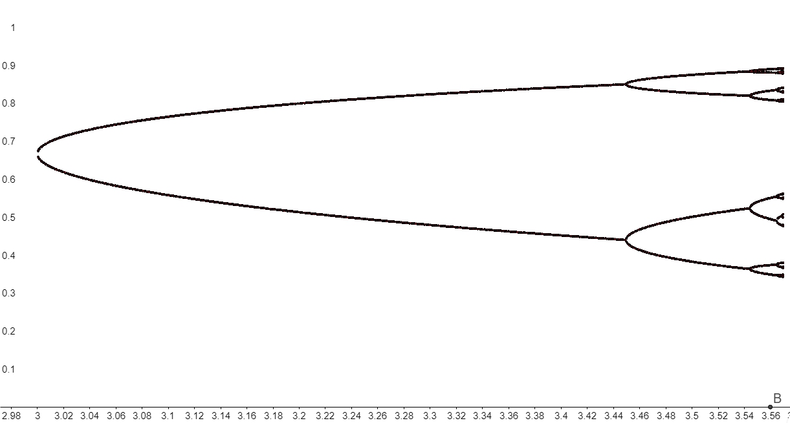
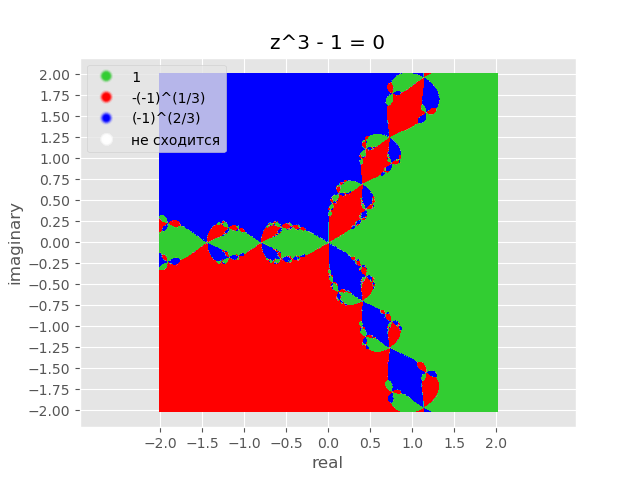

# Домашнее задание 1

## Задание 1

Многочлен $P_n(x) = 3200 x^5 + 480 x^4 - 73624 x^3 - 10686 x^2 + 245645 x - 59598$

#### Локализация

Производная $P_n'(x) = 16000 x^4 + 1920 x^3 - 220872 x^2 - 21372 x + 245645$
$16000 x^4 + 1920 x^3 - 220872 x^2 - 21372 x + 245645 = 0$
Корни: $x \approx -3.5554 \\ x \approx -1.1580 \\ x \approx 1.0534 \\ x\approx 3.5400$

Возьмём отрезки с концами близкими к корням уравнения производной в качестве разбиения

|   $x$    |  -4.5   |  -2.5  |  -0.5   |  1.5  |   3.5   |   5.5   |
| :------: | :-----: | :----: | :-----: | :---: | :-----: | :-----: |
| $P_n(x)$ | -380475 | 116127 | -175959 | 63075 | -734643 | 5263335 |

Выберем отрезки $[-4.5;-2.5],\ [-2.5;-0.5],\ [-0.5;1.5],\ [1.5;3.5],\ [3.5;5.5]$

Для любого $a$ и $b$, которые являются границами выбранных отрезков, выполняется условие: $f(a) f(b) < 0$

Так как мы нашли пять отрезков, удовлетворяющих этому условию, и максимальное количество корней уравнения многочлена пятой степени равно пяти, то на каждом отрезке ровно один корень

#### Нахождение корней методом Ньютона

$x_{n + 1} = x_n - {f(x_n) \over f'(x_n)} = x_n - {P_n(x_n) \over P_n'(x_n)}, \ \epsilon = 10^{-6}$

| итерации | $[-4.5; -2.5]$ | $[-2.5; -0.5]$ | $[-0.5; 1.5]$ | $[1.5; 3.5]$ | $[3.5; 5.5]$ |
| :------: | :------------: | :------------: | :-----------: | :----------: | :----------: |
|    1     | -4.3312899768  | -2.2612397820  | 0.2155502511  | 1.8219837248 | 4.8739461899 |
|    2     |  -4.300928818  | -2.2500386685  | 0.2496899396  | 1.7532514185 | 4.5286058187 |
|    3     | -4.3000008506  | -2.2500000005  | 0.2499999724  | 1.7500074089 | 4.4127323851 |
|    4     | -4.3000000000  | -2.2500000000  | 0.2500000000  | 1.7500000000 | 4.4001411870 |
|  корень  |      -4.3      |     -2.25      |     0.25      |     1.75     |     4.4      |

Значения получены из программы, в качестве начального приближения бралось такое $x_0$, что $f(x_0) f(x_0)'' = P_n(x_0) P_n(x_0)'' > 0$
Значения получены из программы, в качестве начального приближения бралось такое $x_0$, что $f(x_0) f(x_0)'' = P_n(x_0) P_n(x_0)'' > 0$

## Задание 2

Будем везде брать $x_0 = 0.5$

1. $0 < r < 1$

   + Возьмём  $r = 0.5$
     
     $\phi(x) = {1 \over 2} x (1 - x)$

     $\phi'(x) = {1 \over 2} - x$

     По теореме о сходимости метода простых итераций итерационная последовательность сходится к корню $x = 0$, так как на отрезке $x \in [0 - \delta, 0 + \delta]$ проихводная $\phi'(x)$ непрерывна и $|\phi'(x)| < 1$

     Путь итерационной последовательности: 
     
     
     
     График: i -> $x_i$
     
     
     
     

2. $1 < r < 3$

   - $1 < r < 2$

     Пусть $r = 1.5$

     $\phi(x) = {3 \over 2} x (1 - x)$

     $\phi'(x) = {3 \over 2} - 3x$

     При $x \in [{1 \over 3} - \delta, {1 \over 3} + \delta]$ производная непрерывна и $|\phi'(x)| < 1$ $\implies$ по теореме о сходимости метода простых итераций последовательность сходится к корню $x = {1 \over 3}$

     Путь итерационной последовательности: 
     
     
     
     График: i -> $x_i$
     
     
     
     График иллюстрирует монотонную сходимость.
     
   - $2 < r < 3$

     пусть $r = 2.5$

     $\phi(x) = {5 \over 2} x (1 - x)$

     $\phi'(x) = {5 \over 2} - {5 \over x}$

     Аналогично итерационная последовательность сходится к корню $x = {3 \over 5}$ , т. к. при $x \in [{3 \over 5} - \delta, {3 \over 5} + \delta]$ производная непрерывна и ее модуль $|\phi'(x)| < 1$ меньше единицы (т.е. выполняется условие Липшица).

     Путь итерационной последовательности: 

     

     График: i -> $x_i$
     
     
     
     В данном случае мы уже имеем колебательную сходимость.
     
     
     
     

3. При r $\in$ (3; $r_{\infty}$) мы уже не можем применить теорему о сходимости, т.к. не выполняется условие Липшица $\implies$ итерационная последовательность не сходится к одному корню. Она распадается на 2, 4, 8... подпоследовательностей, каждая из которых имеет свой предел. Это можно проследить на графике:

   

4. Покажем, что в диапозоне $r_\infty < r < 4$ поведение итерационной последовательности становится похожим на случайное (детерминированный хаос):

   

Также заметим, что если рассмотреть один из подпромежутков, то при некоторых значениях $r$ 	имеются области сгущения и разрежения итерационной последовательсти. Этот график рассматривает часть предыдущего графика для наглядности

​	

Этот график показывает, что в окрестности $r = 4$ поведение итерационной последовательности становится похожим на белый шум

## Задание 3 

Для случайных начальных значений:

